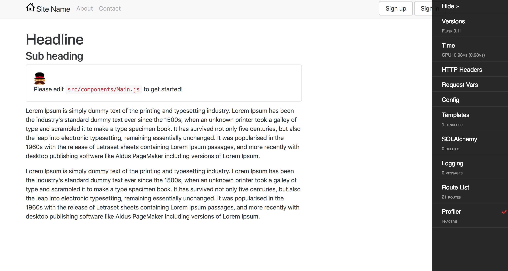

## Contains:

- SQLALCHEMY with basic user schema for authentication in `app/models`

- Facebook and Google authentication and form login

- ReactJS and Redux are in: `app/static/src`

- Bootstrap v4 which can easily be replaced. Styles are in: `app/static/src/styles`

- Mailgun transactional mails. All settings are in: `app/settings.py`

- Webpack asset management

Others include Babel internationalizing, WTForms, timeago jinja filter (`app/tpl_filter.py`) and a simple json serializer in `app/models/serialize.py.

## Get started:

### Back end:
The configurations are in `app/settings.py`. You can customize the `Makefile` to suit your setup.

```
    git clone https://github.com/lassegit/flask-reactjs my-project-name
    cd my-project-name && rm -r .git

```

Then install the static assets and run webpack:
```
    npm install && npm run dev (to build run npm run build)
```

Then install Flask, create the database schema:

```
    make env

    make createdb

    make local
```

It is now running locally on: [localhost:5000](http://localhost:5000).

You can also run the flask using:

```
    source venv/bin/activate
    ./manage.py runserver (or app_ENV="prod" ./manage.py runserver for production)
```

### Front end

You can run two commands with the webpack server: `webpack --dev` for development which will watch for changes and generate files in `app/static/dev`. And for production: `webpack --build` which will build assets for production in `app/build`.

All webpack configuration are in `webpack.config.js` and `webpack.parts.js`.

Note: If you want to use [react-lite](https://github.com/Lucifier129/react-lite) instead, you can enable it in the `webpack.config.js` under `resolve alias`.

## ReactJS command line
Since the ReactJS/Redux is based on [React Webpack Generator including Redux support](https://github.com/stylesuxx/generator-react-webpack-redux) you can also use its command line tools.notice


```
    Install dependencies

    npm install -g yo
    npm install -g generator-react-webpack-redux

    ----

    Navigate to: app/static

    ----

    Generating new reducers

    yo react-webpack-redux:reducer my/namespaced/reducers/name
    yo react-webpack-redux:reducer items

    ----

    Generating new actions

    yo react-webpack-redux:action my/namespaced/actions/name
    yo react-webpack-redux:action addItem
    
    ----

    Generating new components

    yo react-webpack-redux:component my/namespaced/components/name
    yo react-webpack-redux:component button
    
    ----

    Generating new containers

    yo react-webpack-redux:container my/namespaced/container/Name
    yo react-webpack-redux:container wrapper
```


## Thanks

Special thanks to: [React Webpack Generator including Redux support](https://github.com/stylesuxx/generator-react-webpack-redux) for which this boilerplate is partly based.

[SurviveJS](http://survivejs.com/webpack/introduction/) for a thorough Webpack guide and examples.

